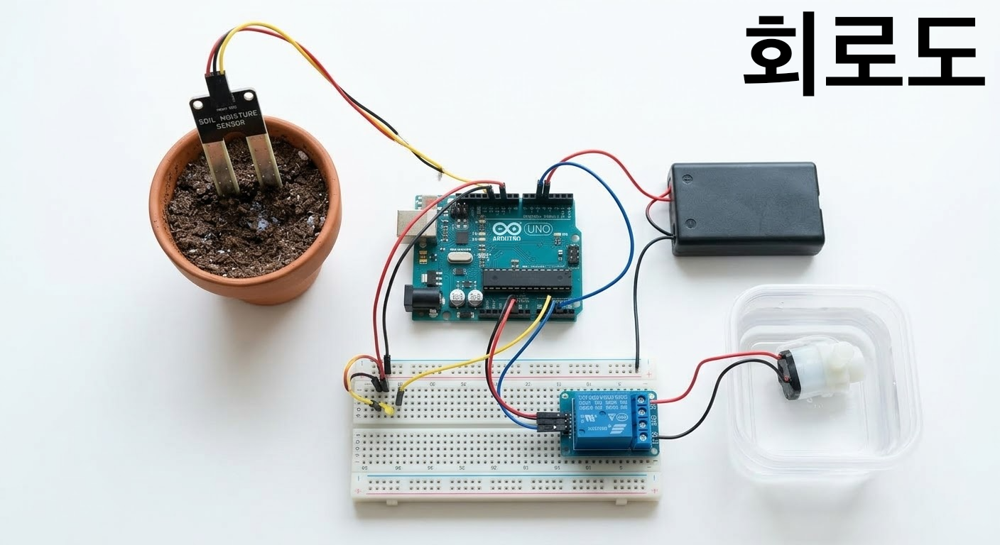

# 아두이노 자동 화분 급수 시스템
아두이노 우노와 토양 수분 센서를 사용하여 화분의 수분 상태를 실시간으로 모니터링하고, 설정한 임계값보다 건조해지면 자동으로 물을 공급하는 스마트 시스템입니다.

## ✨ 주요 기능
* **노이즈 필터링:** 센서 값을 10번 읽어 평균을 내어 오작동을 방지합니다.
* **스마트 급수 간격:** 한 번 물을 준 뒤 일정 시간(Cool-down) 동안 대기하여 과급수를 막습니다.
* **시리얼 모니터링:** 수분 값과 시스템의 작동 상태를 실시간으로 확인할 수 있습니다.

## 🔌 회로도

> **참고:** 아두이노 디지털 7번 핀으로 트랜지스터를 제어하여 릴레이를 구동합니다. 펌프 전원은 아두이노 보드에 무리를 주지 않도록 외부 6V 전원을 별도로 사용합니다.

## 📦 구성 부품
* Arduino Uno
* 토양 수분 센서 (Soil Moisture Sensor)
* 5V 릴레이 모듈 (Relay)
* DC 물 펌프 (Water Pump)
* NPN 트랜지스터 (C945/2N2222 등)
* 1kΩ 저항 & 플라이백 다이오드
* 6V 외부 전원 및 브레드보드

## ⚠️ 주의 사항
코드는 똑바로 만들었는데 똑바로 고정 안해두면 아두이노가 자폭할수도 있음. 그런 실수를 누가 하냐고? 그게나임…
